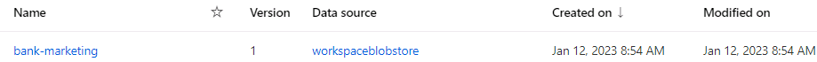

# Operationalizing Machine Learning
In this project, we will continue the work with the Bank Marketing dataset. We will use Azure to configure a cloud-based machine learning production model, deploy it, and consume it. We will also create, publish, and consume a pipeline.

## Architectural Diagram
The figure below shows steps that will be implemented in this project:

## Key Steps
### 1. Authentication
Authentication means, we need to install the Azure Machine Learning Extension which allows us to interact with Azure Machine Learning Studio (part of the az command). After having the Azure machine Learning Extension, we create a Service Principal account and associate it with specific workspace.

Note: I am using provided project lab with authentication done, so I skiped this step.

### 2. Automated ML Experiment
In this step, We will create an experiment using Automated ML, configure a compute cluster, and use that cluster to run the experiment. We need to upload the dataset to Azure Machine Learning Studio so that it can be used when training the model.

#### Select and upload the Bankmarketing dataset
Screenshot of the registered dataset in ML studio that Bankmarketing dataset available:

#### Create a new Auto ML experiment 
We create a new Auto ML experiment, name it automl_experiment-bankmarketing, specify y as the target column and create a new compute cluster using Standar_DS3_v2 machine (minimum number of nodes = 1). In the Configure run section we selected task type to Classification, checked the Explain best model option, set on Exit criterion, set Training job time to 1 hour and on Concurency set Max. concurent iteration to 5.
Screenshot showing that the experiment is shown as completed:

#### Selecting best model
After the experiment is completed, the best model summary shows the best performing model in terms of accuracy.
Screenshot showing best model after experiment is completed:

### 3. Deploy the best model
After the experiment run completes, the best model will be selected for deployment. The best model will then be available through HTTP API service by sending data over POST requests.

### 4. Enable logging
Now that the Best Model is deployed, enable Application Insights and retrieve logs. Although this is configurable at deploy time with a check-box, it is useful to be able to run code that will enable it for you.

 Screenshot showing that "Application Insights" is enabled in the Details tab of the Endpoint:
 
 Screenshot showing logs by running the provided logs.py script
 

### 5. Swagger Documentation
Swagger is an Interface Description Language for describing RESTful APIs expressed using JSON. Swagger is used together with a set of open-source software tools to design, build, document, and use RESTful web services.
In order to cosume the deployed model using Swagger, Azure provides a Swagger JSON file for deployed models. We can find and download it from the Endpoints section under the deployed model.

### 6. Consume model endpoints
Now it's time to interact with the deployed model and to test it, we use the endpoint.py script to call the trained model and feeding it with some test data. Before we run the script, we need to modify both the scoring_uri and the key to match the key for our service and the URI that was generated after deployment. This URI can be found in the Details tab, above the Swagger URI.

### 7. Create and publish a pipeline
In this second part of the project, we use the Jupyter Notebook provided: aml-pipelines-with-automated-machine-learning-step.ipynb. The notebook is updated so as to have the same dataset, keys, URI, cluster, and model names that we created in the first part.
The purpose of this step is to create, publish and consume a pipeline using the Azure Python SDK. We can see below the relevant screenshots:

## Screen Recording / Documentation
he screen recording can be found ### here and it shows the project in action. More specifically, the screencast demonstrates:

- The working deployed ML model endpoint
- The deployed Pipeline
- Available AutoML Model
- Successful API requests to the endpoint with a JSON payload

## Standout Suggestions
Future improvements:
- use more data
- train longer
- use deep learning
- create web app for better interaction
- imbalanced data: use random under-sampling of majority class or random over-sampling of minority class

automl-experiment-bank-marketing
yes
compute_instance
